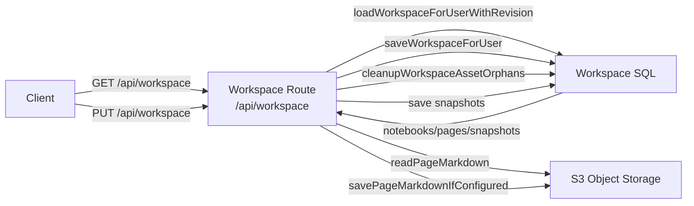

# Visual Note Architecture

This folder is the canonical architecture reference for storage, notebook persistence, and page content lifecycle.

Visual Note uses a **hybrid storage model**:

- Supabase stores the structured workspace graph (notebooks, pages, topics, views, snapshots).
- S3-compatible object storage stores rendered page markdown and uploaded assets.

## Core references

- [Notebook, page, and content storage deep-dive](./notebook-storage.md)
- [Custom markdown syntax](./custom-markdown-syntax.md)
- [Workspace contracts](../../src/lib/visual-note/types.ts)
- [Workspace route](../../src/app/api/workspace/route.ts)
- [Workspace contract parser](../../src/app/api/workspace/route-contract.ts)
- [Persistence schema](../../supabase/schema.sql)

## Architecture map

## Data model map

| Domain           | SQL table                         | Notes                                                                          |
| ---------------- | --------------------------------- | ------------------------------------------------------------------------------ |
| Notebook         | `visual_note_notebooks`           | One row per notebook, includes slug, summary, published state, editor settings |
| Page graph shell | `visual_note_pages`               | One row per page; `topics` and `views` are serialized JSONB columns            |
| Snapshot         | `visual_note_workspace_snapshots` | Keeps checkpoint copies of normalized workspace for restore/publish contexts   |
| Storage settings | `visual_note_notebook_storage`    | Connects notebook to an encrypted S3 credential set                            |
| S3 credentials   | `visual_note_s3_connections`      | Stores endpoint/region/key metadata                                            |
| Asset index      | `visual_note_assets`              | Maps uploaded media to object keys and owner scope                             |

## Primary API touchpoints

- `GET /api/workspace`: read the full workspace
- `PUT /api/workspace`: save the full workspace with revision checks
- `GET /api/pages/[pageId]/content`: fetch page markdown
- `PUT /api/pages/[pageId]/content`: write page markdown directly
- `GET/PUT /api/notebooks/[notebookId]/storage-settings`: read/write notebook storage wiring
- `POST /api/notebooks/[notebookId]/assets`: upload notebook media
- `POST /api/notebooks/[notebookId]/publish`: generate preview or mutate published state
- `GET /api/assets/[assetId]`: resolve private/signed asset delivery

Related route files:
[workspace](../../src/app/api/workspace/route.ts),
[page content](../../src/app/api/pages/%5BpageId%5D/content/route.ts),
[storage settings](../../src/app/api/notebooks/%5BnotebookId%5D/storage-settings/route.ts),
[assets](../../src/app/api/notebooks/%5BnotebookId%5D/assets/route.ts),
[publish](../../src/app/api/notebooks/%5BnotebookId%5D/publish/route.ts),
[assets delivery](../../src/app/api/assets/%5BassetId%5D/route.ts).

## Where to inspect behavior

- Start with the [workspace route](../../src/app/api/workspace/route.ts)
- Review the [workspace store](../../src/server/visual-note/workspace-store.ts)
- Review the [page content route](../../src/app/api/pages/%5BpageId%5D/content/route.ts) and [page content store](../../src/server/visual-note/page-content-store.ts)

## Suggested reading order

1. Start with [notebook-storage.md](./notebook-storage.md) for the end-to-end persistence model.
2. Read [custom-markdown-syntax.md](./custom-markdown-syntax.md) for the page article markdown contract.
3. Open [workspace route code](../../src/app/api/workspace/route.ts) and [workspace store](../../src/server/visual-note/workspace-store.ts).
4. Inspect [object storage adapter](../../src/server/storage/notebook-storage.ts) and [S3 wrapper](../../src/server/storage/s3.ts).

## External references

- [Next.js Route Handlers](https://nextjs.org/docs/app/building-your-application/routing/route-handlers)
- [Supabase JavaScript client](https://supabase.com/docs/reference/javascript/start)
- [AWS S3 object key conventions](https://docs.aws.amazon.com/AmazonS3/latest/userguide/object-keys.html)
