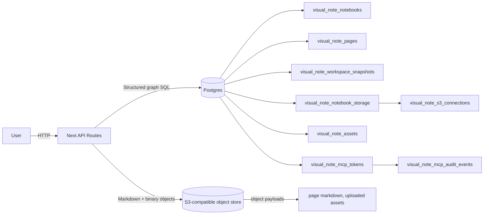
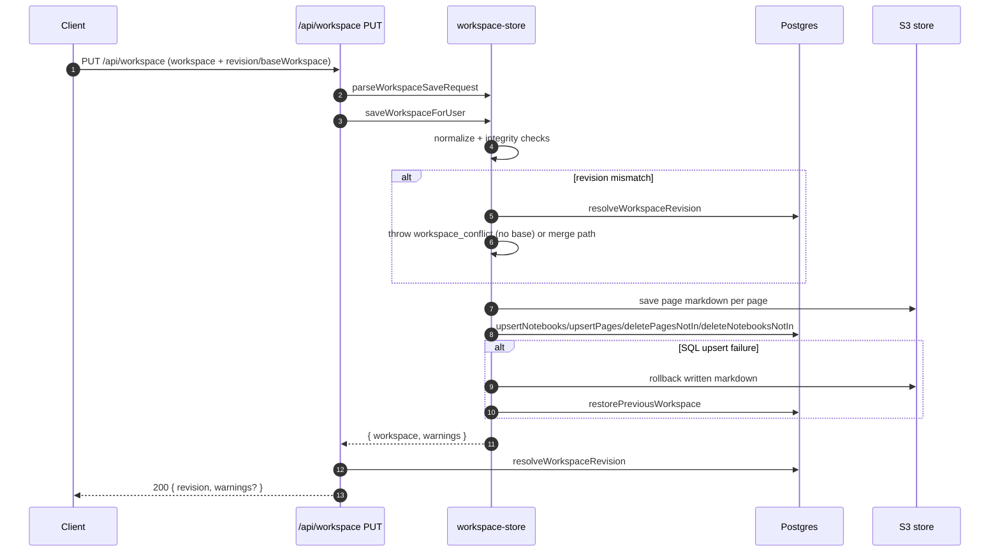
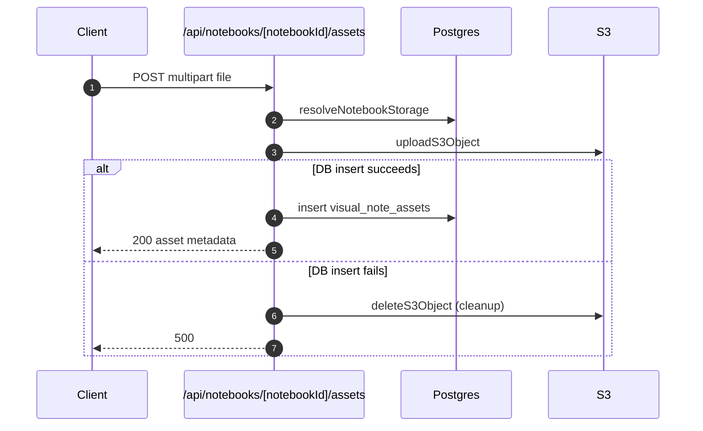

# Notebook, Page, and Content Storage

Last updated: 2026-07-05

## Table of contents

1. [Purpose](#purpose)
2. [Completeness status](#completeness-status)
3. [Page markdown storage migration requirements](#page-markdown-storage-migration-requirements)
    1. [Decision](#decision)
    2. [Target storage contract](#target-storage-contract)
    3. [Markdown format contract](#markdown-format-contract)
    4. [Data ownership boundaries](#data-ownership-boundaries)
    5. [Implementation plan](#implementation-plan)
    6. [Migration and compatibility plan](#migration-and-compatibility-plan)
    7. [Validation and acceptance criteria](#validation-and-acceptance-criteria)
4. [Scope](#scope)
    1. [Endpoint inventory](#endpoint-inventory)
    2. [Storage modules used for notebook/content persistence](#storage-modules-used-for-notebookcontent-persistence)
    3. [Explicit scope exclusions](#explicit-scope-exclusions)
    4. [Route auth and pre-write failure paths](#route-auth-and-pre-write-failure-paths)
5. [Scope coverage guarantees](#scope-coverage-guarantees)
    1. [Delete semantics and absence-based updates](#delete-semantics-and-absence-based-updates)
6. [Storage topology](#storage-topology)
7. [Exhaustive behavior map (storage-relevant endpoints)](#exhaustive-behavior-map-storage-relevant-endpoints)
    1. [Non-notebook persistence endpoint map](#non-notebook-persistence-endpoint-map)
8. [MCP storage matrix](#mcp-storage-matrix)
    1. [MCP token validation side effects](#mcp-token-validation-side-effects)
9. [Exhaustive status outcomes and storage side effects](#exhaustive-status-outcomes-and-storage-side-effects)
10. [Domain mapping and invariants](#domain-mapping-and-invariants)
11. [Persistent domain graph](#persistent-domain-graph)
12. [Invariants enforced during save](#invariants-enforced-during-save)
13. [Schema mapping: SQL columns and their semantic role](#schema-mapping-sql-columns-and-their-semantic-role)
14. [Critical content model behavior](#critical-content-model-behavior)
    1. [Page markdown content location](#page-markdown-content-location)
    2. [Object key conventions](#object-key-conventions)
15. [API matrix with request/response contracts](#api-matrix-with-requestresponse-contracts)
    1. [MCP token endpoint detail](#mcp-token-endpoint-detail)
16. [Transaction and compensation model](#transaction-and-compensation-model)
    1. [Save with rollback strategy](#save-with-rollback-strategy)
    2. [Delete compensation](#delete-compensation)
17. [Object storage and key lifecycle](#object-storage-and-key-lifecycle)
    1. [Read/write routines](#readwrite-routines)
    2. [Asset key lifecycle](#asset-key-lifecycle)
    3. [Orphan scans and asset ID extraction](#orphan-scans-and-asset-id-extraction)
18. [Readiness and schema validation](#readiness-and-schema-validation)
    1. [Important policy caveat](#important-policy-caveat)
19. [Security and authorization](#security-and-authorization)
    1. [Database client context by endpoint](#database-client-context-by-endpoint)
20. [Environment dependency matrix](#environment-dependency-matrix)
21. [Observability hooks](#observability-hooks)
22. [Exact parse/error messages (implementation contract)](#exact-parseerror-messages-implementation-contract)
23. [Cross-endpoint sequence diagrams](#cross-endpoint-sequence-diagrams)
    1. [Workspace save + revision conflict path](#workspace-save--revision-conflict-path)
    2. [Image upload with DB cleanup fallback](#image-upload-with-db-cleanup-fallback)
24. [Implementation evidence](#implementation-evidence)
    1. [MCP scope and enforcement matrix](#mcp-scope-and-enforcement-matrix)
25. [Practical checks](#practical-checks)

## Purpose

This document is the canonical storage reference for how Visual Note persists:

- notebook metadata (`notebooks`)
- page structure (`pages`)
- page content blobs (`markdown`)
- binary assets (`images`)

The intent is to capture exactly what is written, where it is written, and how partial failures are handled.

## Completeness status

This document is **complete for the current repository implementation** as of the
last `Last updated` date, and now includes all persistence-affecting endpoints,
save/rollback families, and MCP mutation pathways.

The only notable non-document caveat is that MCP transport middleware can return
low-level protocol-level errors before route handlers are reached.

## Page markdown storage migration requirements

This section records the target requirements for making markdown files in MinIO/S3
the canonical article-content storage format for notebook pages.

### Decision

Page article content must be stored as markdown object files, not as JSON schemas
or serialized editor block schemas.

- Canonical page content location: MinIO/S3-compatible object storage.
- Canonical page content format: markdown text.
- Canonical page storage serializer: [`pageMarkdownFromWorkspace`](../../src/server/visual-note/workspace-store-save-helpers.ts), which emits page-scoped markdown with stable topic/view markers.
- Canonical export renderer: [`renderMarkdownExport`](../../src/lib/visual-note/export/markdown.ts), used for user-facing export and preview flows, not as the general page-object serializer.
- Canonical page object writer/reader: [`page-content-store.ts`](../../src/server/visual-note/page-content-store.ts).
- SQL page rows remain the canonical graph/index metadata store. When markdown
  object storage succeeds, `visual_note_pages.views` must not contain article body
  content; when storage is not configured, routes that continue with warnings
  preserve view content in SQL as a temporary availability fallback.

### Target storage contract

Each persisted notebook page has one markdown object:

| Concern                | Requirement                                                                                                                                                       |
| ---------------------- | ----------------------------------------------------------------------------------------------------------------------------------------------------------------- |
| Object key             | `notebooks/${notebookId}/pages/${pageId}.md` from [`makePageObjectKey`](../../src/server/visual-note/page-store.ts)                                               |
| Bucket/connection      | Resolved through `visual_note_notebook_storage` and `visual_note_s3_connections`                                                                                  |
| Content type           | `text/markdown; charset=utf-8`                                                                                                                                    |
| Body encoding          | UTF-8 markdown                                                                                                                                                    |
| Object metadata        | At minimum `notebookid` and `pageid`                                                                                                                              |
| SQL pointer            | `visual_note_pages.content_object_key` stores the object key                                                                                                      |
| SQL body storage       | Not normal canonical storage; only storage-unavailable warning paths may preserve view content as fallback                                                        |
| Missing storage config | Mutation may return a warning only where the route already supports warning payloads; fully strict routes should fail with the existing MinIO configuration error |

The database stores the navigable notebook graph:

- notebook title, slug, summary, color, publish state, and editor settings
- page title, page position, notebook ownership, and `content_object_key`
- topics and views as graph/editor metadata required to rebuild the notebook UI
- asset records, storage connection rows, workspace snapshots, and MCP token/audit rows

The database must not become the intended source of truth for page article
bodies. SQL view-content preservation exists only for storage-unavailable warning
paths so the app does not discard user content before object storage is set up.
Any future JSON editor schema should be treated as transient UI state, derived
cache, explicit migration input, or an explicitly temporary fallback, not the
normal canonical page content.

### Markdown format contract

The stored page markdown is page-scoped markdown for persistence, not the same
document as user-facing Export to Markdown. It must keep enough structure to
hydrate the notebook graph back into all topic/view article bodies.

Current page storage serialization behavior:

1. Use `pageMarkdownFromWorkspace(workspace, pageId)`.
2. Render the page title as an H1 (`# Page title`).
3. For each topic in position order, write `<!-- visual-note:topic {topicId} -->` followed by `## Topic title`.
4. For each view in that topic, write `<!-- visual-note:view {viewId} -->` followed by `### View title`.
5. For each non-empty view body, parse and serialize through the article-content pipeline before writing markdown.
6. Preserve intentionally empty view bodies by still writing the view marker and `### View title`; do not inject editor helper text into storage.
7. Uploaded binary assets remain separate S3 objects tracked by `visual_note_assets`; page markdown may contain asset references that orphan cleanup can inspect.

Export to Markdown is separate. Export uses `createExportDocument` and
`renderMarkdownExport`, selects one display view per topic (`mode === "article"`,
then first view, then no body), and omits the storage-only topic/view markers.
The shared boundary between page storage and export is article block
parse/serialize behavior, not an identical whole-page renderer.

### Data ownership boundaries

This migration keeps three storage responsibilities separate:

| Data class             | Canonical store                                   | Reason                                                                                                      |
| ---------------------- | ------------------------------------------------- | ----------------------------------------------------------------------------------------------------------- |
| Notebook/page graph    | Postgres normalized rows                          | Fast workspace listing, ownership checks, ordering, revision calculations, and search indexing              |
| Page article content   | MinIO/S3 markdown object                          | Human-readable content, full topic/view hydration, lower DB row weight, and object-level rollback semantics |
| Uploaded images/assets | MinIO/S3 binary object + `visual_note_assets` row | Private delivery, signing, cleanup, MIME validation, and orphan detection                                   |

The product model remains structured. Storing article content as markdown does not
turn a notebook into a folder of markdown documents; notebooks, pages, topics,
views, components, and data continue to be explicit platform concepts. Markdown is
the persistence format for the article body inside that model.

### Implementation plan

1. **Lock the page storage serialization boundary**
    - Use [`pageMarkdownFromWorkspace`](../../src/server/visual-note/workspace-store-save-helpers.ts) for workspace saves and page-save derived markdown.
    - Keep storage markers generated by `pageTopicMarker` and `pageViewMarker` stable enough for [`hydrateViewsFromPageMarkdown`](../../src/server/visual-note/page-markdown-hydration.ts).
    - Verify saved page object bodies preserve every topic/view article body when changing this path.

2. **Make object storage the only article-body persistence path**
    - Ensure `visual_note_pages` normally stores graph fields, denormalized topic/view metadata with stripped `content`, and `content_object_key`.
    - Preserve SQL view content only on the existing storage-unavailable fallback paths where `savePageMarkdownIfConfigured` returns `{ saved: false }`.
    - Reject or ignore any future request shape that attempts to make page article body JSON the normal SQL source of truth.
    - Keep `GET /api/pages/[pageId]/content` returning `{ pageId, markdown }`.
    - Keep `PUT /api/pages/[pageId]/content` accepting `{ markdown }`; do not introduce a JSON-schema content contract.

3. **Preserve current page save semantics**
    - `PUT /api/workspace` writes markdown per page during full workspace saves.
    - `POST /api/notebooks` writes the optional home page markdown when a home page is created.
    - `PUT /api/pages/[pageId]` writes provided `markdown` when present; otherwise it derives page markdown from the submitted page/topics/views graph.
    - `PUT /api/pages/[pageId]/content` writes raw markdown directly to the page object.
    - Rollbacks must restore the previous markdown object when SQL persistence fails after object upload.

4. **Keep page reads markdown-first**
    - Workspace hydration should read each page's `content_object_key` from object storage and populate in-memory page/view content from markdown only.
    - A missing object returns `null` from `readPageMarkdown`. If SQL view content was preserved by a storage-unavailable fallback path, hydration keeps those existing view bodies; otherwise content reads such as `GET /api/pages/[pageId]/content` return 404.
    - Search and orphan cleanup should continue to inspect markdown bodies loaded from object storage.

5. **Normalize editor integration around markdown**
    - Article editor save operations should serialize editor state to markdown before object persistence.
    - Editor load operations should parse markdown into the structured editing model in memory.
    - Empty headings, lists, quotes, callouts, code blocks, and visual blocks must round-trip through markdown without falling back to raw JSON schemas.

6. **Protect asset behavior**
    - Page markdown may reference private assets through `/api/assets/{assetId}` URLs when the editor content includes asset references.
    - Uploaded image binaries continue to be stored separately through the asset upload pipeline.
    - Orphan scans must continue extracting asset IDs from stored markdown and from graph metadata.

7. **Update contracts and acceptance checks**
    - Keep route/store contracts explicit that no page article body JSON is written to `visual_note_pages`.
    - Verify the content route shape remains `markdown` only and workspace-save markdown preserves all topic/view content through storage markers.
    - Verify rollback behavior restores markdown objects when SQL writes fail.
    - Include migration fixtures or manual acceptance checks for any legacy JSON-schema page content that still exists in deployed environments.

### Migration and compatibility plan

The desired end state has no canonical JSON-schema page content. If a deployment
contains legacy JSON page bodies, migrate it once into markdown objects:

1. Inventory legacy rows or payloads that contain article body JSON.
2. For each page, reconstruct the in-memory page/topic/view model.
3. Use the page storage serializer to generate marked page-scoped markdown.
4. Upload the markdown to `notebooks/${notebookId}/pages/${pageId}.md`.
5. Set or verify `visual_note_pages.content_object_key`.
6. Remove or ignore the legacy JSON body field after the object is verified.
7. Re-run workspace health, page content read checks, search checks, and orphan asset cleanup.

Do not keep a long-term dual-write model where JSON schemas and markdown objects
both claim to be canonical. A temporary migration read path may be acceptable only
if it is one-way, emits clear telemetry, writes the markdown object immediately,
and has a planned removal.

### Validation and acceptance criteria

This feature is complete only when all of the following are true:

- Creating a notebook with a home page creates a `.md` page object when notebook storage is configured.
- Saving a workspace with configured object storage writes one markdown object per page and stores only graph metadata plus the object key in SQL.
- Saving page content writes `text/markdown; charset=utf-8` to MinIO/S3.
- Reading page content returns markdown from object storage.
- Export to Markdown and page storage share article block parse/serialize semantics, while page storage preserves all topic/view bodies through markers.
- No route stores page article content as a JSON schema in Postgres.
- Storage-unavailable warning paths may preserve view content in SQL, and those paths must remain explicitly treated as fallback behavior.
- Missing object storage does not silently write a JSON fallback.
- Rollback paths restore prior markdown object content after downstream SQL failures.
- Page delete removes the page row and attempts to delete the corresponding markdown object.
- Orphan asset cleanup still detects `/api/assets/{assetId}` references in stored markdown.
- Tests cover marked page markdown round trips, strict content route shape, save rollback, legacy migration fixtures, and normal absence of SQL body persistence after successful object writes.

## Scope

### Endpoint inventory

#### Notebook/content persistence surfaces

- `GET /api/notebooks`
- `POST /api/notebooks`
- `GET /api/workspace` (full workspace load)
- `PUT /api/workspace`
- `GET /api/workspace/health`
- `POST /api/workspace/health`
- `GET /api/notebooks/[notebookId]`
- `PUT /api/notebooks/[notebookId]`
- `GET /api/notebooks/[notebookId]/storage-settings`
- `PUT /api/notebooks/[notebookId]/storage-settings`
- `POST /api/notebooks/[notebookId]/assets`
- `POST /api/notebooks/[notebookId]/publish`
- `GET /api/pages/[pageId]`
- `PUT /api/pages/[pageId]`
- `DELETE /api/pages/[pageId]`
- `GET /api/pages/[pageId]/content`
- `PUT /api/pages/[pageId]/content`
- `GET /api/notebooks/[notebookId]/search`
- `GET /api/assets/[assetId]`
- `DELETE /api/assets/[assetId]`
- `GET /api/assets/[assetId]/sign`
- `POST /api/maintenance/assets` (optional maintenance cleanup endpoint)

#### MCP transport and token-management surfaces

- `GET /api/mcp`
- `POST /api/mcp`
- `OPTIONS /api/mcp`
- `POST /api/mcp/tokens`
- `GET /api/mcp/tokens`
- `DELETE /api/mcp/tokens/[tokenId]`

### Storage modules used for notebook/content persistence

- `src/server/visual-note/workspace-store.ts`
- `src/server/visual-note/workspace-asset-reconciliation-store.ts`
- `src/server/visual-note/workspace-snapshot-store.ts`
- `src/server/visual-note/workspace-revision-store.ts`
- `src/server/visual-note/workspace-readiness.ts`
- `src/server/visual-note/workspace-merge.ts`
- `src/server/visual-note/workspace-store-save-helpers.ts`
- `src/server/visual-note/page-content-store.ts`
- `src/server/visual-note/notebook-store.ts`
- `src/server/visual-note/page-store.ts`
- `src/server/visual-note/workspace-operations.ts`
- `src/server/visual-note/workspace-operations/read-model.ts`
- `src/server/visual-note/workspace-operations/selectors.ts`
- `src/server/visual-note/workspace-operations/result.ts`
- `src/server/visual-note/workspace-operations/types.ts`
- `src/server/visual-note/workspace-operations/exports.ts`
- `src/server/visual-note/workspace-operations/notebooks.ts`
- `src/server/visual-note/workspace-operations/articles.ts`
- `src/server/visual-note/workspace-operations/visual-blocks.ts`
- `src/server/visual-note/workspace-operations/health.ts`
- `src/server/visual-note/notebook-search-store.ts`
- `src/server/storage/notebook-storage.ts`
- `src/server/storage/notebook-asset-cleanup.ts`
- `src/server/storage/asset-signing.ts`
- `src/server/storage/encryption.ts`
- `src/server/storage/s3.ts`
- `src/server/storage/upload-validation.ts`
- `src/server/mcp/visual-note-tools.ts`
- `src/server/mcp/visual-note-workspace-tools.ts`
- `src/server/mcp/visual-note-server-core.ts`
- `src/server/mcp/token-store.ts`

### Explicit scope exclusions

- Route transport surfaces:
    - `GET /api/mcp`, `POST /api/mcp`, `OPTIONS /api/mcp` are transport/auth/origin checks and tool dispatch; only MCP request events and audit entries may be emitted.
- MCP token routes (`/api/mcp/tokens*`) manage token metadata only and do not mutate notebook/page/asset tables.

### Route auth and pre-write failure paths

- `authenticateSupabaseRequest` / `authenticateSupabaseMutationRequest` failures happen before handler execution:
    - `401` + `Authentication required.` for missing or invalid session state.
    - `403` + `Cross-origin mutation requests are not allowed.` for mutation routes from a different origin.
    - `403` + `Invalid request origin.` when the `origin` header is present but not parseable.
    - `503` + `Application database auth is not configured.` when service-role env vars are missing and auth cannot resolve a DB client.
- Routes with additional service-role requirement beyond auth can fail fast with:
    - `503` + `Server database access is not configured for storage routes.`
    - `503` + `Server database access is required for MCP token management.`
    - these are emitted before any persistence work for that route body.
- `Server database access is required for MCP routes.` is emitted from MCP execution path (`src/server/mcp/visual-note-server-core.ts`) after tool auth scope checks, when a service-role-backed workspace load is attempted.
- `/api/mcp` additionally enforces origin allowlisting:
    - blocked origin => `403` + `Origin is not allowed.`
- `OPTIONS /api/mcp` performs the same origin allowlist check and returns `204` with CORS preflight headers on pass.
- `/api/assets/[assetId]` signed requests skip `authenticateSupabaseRequest` and cross-site blocking.

Canonical auth/transport source files:

- [supabase auth helpers](../../src/lib/supabase/server.ts)
- [mcp handler + origin policy](../../src/app/api/mcp/route.ts)

Canonical references:

- [types](../../src/lib/visual-note/types.ts)
- [workspace route](../../src/app/api/workspace/route.ts) + [contract](../../src/app/api/workspace/route-contract.ts)
- [workspace health route](../../src/app/api/workspace/health/route.ts) + [health checks](../../src/server/visual-note/workspace-operations/health.ts)
- [page route](../../src/app/api/pages/%5BpageId%5D/route.ts) + [contract](../../src/app/api/pages/route-contract.ts)
- [content route](../../src/app/api/pages/%5BpageId%5D/content/route.ts)
- [notebooks collection route](../../src/app/api/notebooks/route.ts) (no dedicated route-contract file)
- [notebook detail route](../../src/app/api/notebooks/%5BnotebookId%5D/route.ts)
- [notebook search route](../../src/app/api/notebooks/%5BnotebookId%5D/search/route.ts) + [contract](../../src/app/api/notebooks/%5BnotebookId%5D/search/route-contract.ts)
- [storage-settings route](../../src/app/api/notebooks/%5BnotebookId%5D/storage-settings/route.ts) + [contract](../../src/app/api/notebooks/%5BnotebookId%5D/storage-settings/route-contract.ts)
- [assets upload route](../../src/app/api/notebooks/%5BnotebookId%5D/assets/route.ts) + [contract](../../src/app/api/notebooks/%5BnotebookId%5D/assets/route-contract.ts)
- [publish route](../../src/app/api/notebooks/%5BnotebookId%5D/publish/route.ts) + [contract](../../src/app/api/notebooks/%5BnotebookId%5D/publish/route-contract.ts)
- [asset delivery route](../../src/app/api/assets/%5BassetId%5D/route.ts)
- Search store [search/query execution and pagination defaults](../../src/server/visual-note/notebook-search-store.ts)
- [asset signing route](../../src/app/api/assets/%5BassetId%5D/sign/route.ts) (no dedicated contract file)
- [mcp route](../../src/app/api/mcp/route.ts) + [mcp route contracts](../../src/app/api/mcp/route-contract.ts) + [mcp core execution](../../src/server/mcp/visual-note-server-core.ts)
- [maintenance asset cleanup route](../../src/app/api/maintenance/assets/route.ts)
- MCP tools: [tools registry](../../src/server/mcp/visual-note-tools.ts), [workspace tools](../../src/server/mcp/visual-note-workspace-tools.ts), [core execution](../../src/server/mcp/visual-note-server-core.ts)
- MCP tokens: [token routes](../../src/app/api/mcp/tokens/route.ts), [token delete route](../../src/app/api/mcp/tokens/%5BtokenId%5D/route.ts), [token parse contract](../../src/app/api/mcp/route-contract.ts), [token store](../../src/server/mcp/token-store.ts)
- Workspace internals: [snapshot store](../../src/server/visual-note/workspace-snapshot-store.ts), [revision store](../../src/server/visual-note/workspace-revision-store.ts), [merge helper](../../src/server/visual-note/workspace-merge.ts), [workspace operations](../../src/server/visual-note/workspace-operations.ts), [asset cleanup helpers](../../src/server/visual-note/workspace-asset-reconciliation-store.ts)
- [schema.sql](../../supabase/schema.sql)

## Scope coverage guarantees

This section is intentionally complete: every mutation path that writes user-visible notebook/page/assets content is represented below.

### Delete semantics and absence-based updates

- There is no dedicated `DELETE /api/notebooks/[notebookId]` endpoint in this API surface.
- Notebook and page removals are driven by workspace replacement rules in `saveWorkspaceForUser`:
    - `deletePagesNotIn` removes page rows not present in the incoming workspace payload for that user.
    - `deleteNotebooksNotIn` removes notebook rows not present in the incoming payload (subject to ownership checks).
- Page deletions are also explicit via `DELETE /api/pages/[pageId]`.
- Snapshot pruning (`upsertWorkspaceSnapshotsForUser`) keeps only `snapshots.slice(-30)` per save request; empty incoming snapshot sets do not trigger deletion.

1. Graph writes:
    - full workspace save (`PUT /api/workspace`)
    - notebook-level save (`POST /api/notebooks`, `PUT /api/notebooks/[notebookId]`)
    - page-level save (`PUT /api/pages/[pageId]`, `PUT /api/pages/[pageId]/content`)
    - health repair write (`POST /api/workspace/health`)
2. Asset lifecycle writes:
    - upload (`POST /api/notebooks/[notebookId]/assets`)
    - delete (`DELETE /api/assets/[assetId]`)
    - cleanup (`POST /api/maintenance/assets`)
3. Configuration writes:
    - notebook storage config (`PUT /api/notebooks/[notebookId]/storage-settings`)
4. Derived data writes:
    - snapshot updates (`saveWorkspaceForUser` + `upsertWorkspaceSnapshotsForUser`)

Storage-affecting MCP tools are included below.

- MCP read-only tools included for completeness:
    - `list_notebooks`
    - `read_notebook`
    - `read_article`
    - `workspace_health_check`
    - `export_publish_bundle`
    - `list_workspace_snapshots`

- MCP write tools persisted to workspace store:
    - `create_notebook`
    - `create_article`
    - `replace_article_content`
    - `upsert_visual_block`
    - `remove_visual_block`
    - `repair_workspace_consistency`
    - `publish_notebook`
    - `unpublish_notebook`
    - `create_workspace_snapshot`
    - `restore_workspace_snapshot`

## Storage topology

The graph is normalized in SQL for discoverability and authorization checks, while large blobs are stored in object storage.

## Exhaustive behavior map (storage-relevant endpoints)

This table captures every storage-affecting endpoint in this scope and the exact side effects.

| Endpoint                                           | Storage operations                                                             | Read dependencies                                                                                                                                   | Write operations                                                                                                                | Failure mode class                                                              | Route event emissions                                                                                                                                                     |
| -------------------------------------------------- | ------------------------------------------------------------------------------ | --------------------------------------------------------------------------------------------------------------------------------------------------- | ------------------------------------------------------------------------------------------------------------------------------- | ------------------------------------------------------------------------------- | ------------------------------------------------------------------------------------------------------------------------------------------------------------------------- |
| `GET /api/workspace`                               | none                                                                           | `loadWorkspaceForUserWithRevision`, `loadWorkspaceForUser`, `resolveWorkspaceRevision`                                                              | none                                                                                                                            | `500` only from `loadWorkspaceForUser` failures                                 | `workspace.load_success`, `workspace.load_failed`                                                                                                                         |
| `PUT /api/workspace`                               | full graph write, markdown writes for each page, optional snapshot writes      | `loadWorkspaceForUser`, `resolveWorkspaceRevision`, `readPageMarkdown`, `listNotebooksForUser`, `listPagesForUser`, `listWorkspaceSnapshotsForUser` | `upsertNotebooks`, `upsertPages`, `deletePagesNotIn`, `deleteNotebooksNotIn`, snapshot upsert, markdown object writes/rollbacks | `400` parse/integrity, `409` conflict/merge, `500` unknown + compensation paths | `workspace.save_request_invalid`, `workspace.save_payload_invalid`, `workspace.save_success`, `workspace.save_conflict`, `workspace.save_failed`, `workspace.auth_failed` |
| `GET /api/workspace/health`                        | none                                                                           | `loadWorkspaceForUser`, `workspaceHealthCheck`                                                                                                      | none unless `repairWorkspaceConsistency` returns workspace to persist in POST path                                              | `500` (get) / `400` (post validation) / `500` (save failure)                    | `workspace.health_failed`, `workspace.repair_failed`                                                                                                                      |
| `POST /api/workspace/health`                       | optional full workspace rewrite and snapshot restore                           | same as GET + `repairWorkspaceConsistency`                                                                                                          | `saveWorkspaceForUser` when repaired                                                                                            | `400`/`500`                                                                     | `workspace.repair_failed`                                                                                                                                                 |
| `GET /api/notebooks`                               | none                                                                           | `loadWorkspaceForUser` (hydrates page markdown)                                                                                                     | none                                                                                                                            | `500`                                                                           | none                                                                                                                                                                      |
| `POST /api/notebooks`                              | notebook row + default page/topic/view rows, optional home markdown            | `loadWorkspaceForUser`                                                                                                                              | `upsertNotebooks`, `upsertPages`, markdown write                                                                                | `400` validation, `500` create failure                                          | none                                                                                                                                                                      |
| `GET /api/notebooks/[notebookId]`                  | none                                                                           | `loadWorkspaceForUser`                                                                                                                              | none                                                                                                                            | `404`/`500`                                                                     | none                                                                                                                                                                      |
| `PUT /api/notebooks/[notebookId]`                  | notebook row overwrite                                                         | `loadWorkspaceForUser`                                                                                                                              | `upsertNotebooks`                                                                                                               | `400`/`404`/`500`                                                               | none                                                                                                                                                                      |
| `GET /api/notebooks/[notebookId]/search`           | none                                                                           | `searchNotebookForUser`                                                                                                                             | none                                                                                                                            | `400` parser/invalid input, `500` search runtime                                | none                                                                                                                                                                      |
| `GET /api/notebooks/[notebookId]/storage-settings` | none (read path only)                                                          | `loadNotebookStorageSettings`                                                                                                                       | none                                                                                                                            | `404`/`500`/`503`                                                               | none                                                                                                                                                                      |
| `PUT /api/notebooks/[notebookId]/storage-settings` | `visual_note_s3_connections`, `visual_note_notebook_storage` upsert            | `loadExistingEncryptedSecret` (read path)                                                                                                           | upsert connection + upsert mapping                                                                                              | `400`/`409`/`500`/`503`                                                         | none                                                                                                                                                                      |
| `POST /api/notebooks/[notebookId]/assets`          | `visual_note_assets` insert + S3 upload                                        | `resolveNotebookStorage`, `parseAssetUploadRequest`                                                                                                 | `createAssetRecord`, `uploadS3Object`                                                                                           | `400`/`413`/`415`/`500` + cleanup delete on DB failure                          | `asset.upload_rejected`, `asset.upload_failed`                                                                                                                            |
| `POST /api/notebooks/[notebookId]/publish`         | conditional workspace rewrite                                                  | `loadWorkspaceForUser`, `publishNotebook`                                                                                                           | `saveWorkspaceForUser` for publish/unpublish                                                                                    | `400` parser/validation/preview-not-found, `404`, `409`, `500`                  | none                                                                                                                                                                      |
| `GET /api/pages/[pageId]`                          | none                                                                           | `loadPageById`                                                                                                                                      | none                                                                                                                            | `404`/`500`                                                                     | none                                                                                                                                                                      |
| `PUT /api/pages/[pageId]`                          | markdown write from provided or derived page markdown + page/topic/view upsert | `loadPageById`, `listNotebooksForUser`, `readPageMarkdown`, `userOwnsNotebook`                                                                      | `upsertNotebooks`, `upsertPages`, markdown writes, asset orphan cleanup                                                         | `400`/`404`/`500` + rollback writeback                                          | none                                                                                                                                                                      |
| `DELETE /api/pages/[pageId]`                       | optional markdown deletion + asset cleanup                                     | `loadPageById`, `readPageMarkdown`, `loadWorkspaceForUser`                                                                                          | `deletePage`, `deletePageMarkdown`, `cleanupWorkspaceAssetOrphans`, best-effort `deleteAssetRecord`                             | `404`/`500`                                                                     | none                                                                                                                                                                      |
| `GET /api/pages/[pageId]/content`                  | none                                                                           | `loadPageById`, `readPageMarkdown`                                                                                                                  | none                                                                                                                            | `404`/`500` mapping                                                             | none                                                                                                                                                                      |
| `PUT /api/pages/[pageId]/content`                  | raw markdown object write + orphan cleanup                                     | `loadPageById`                                                                                                                                      | `savePageMarkdownIfConfigured`, `touchPageRevision`, `cleanupWorkspaceAssetOrphans`                                             | `400`/`404`/`500`; storage-unconfigured returns `400`                           | none                                                                                                                                                                      |
| `GET /api/assets/[assetId]`                        | none                                                                           | `loadAssetStorage` / `loadSignedAssetStorage`, `readS3Object`                                                                                       | none                                                                                                                            | `403`/`404`/`415`/`500`/`503`                                                   | `asset.read_blocked`, `asset.read_failed`                                                                                                                                 |
| `DELETE /api/assets/[assetId]`                     | object delete (best effort after row delete)                                   | `loadAssetStorage`                                                                                                                                  | `visual_note_assets` delete + optional `deleteS3Object`                                                                         | `404`/`500`                                                                     | `asset.delete_record_failed`, `asset.delete_object_failed`                                                                                                                |
| `GET /api/assets/[assetId]/sign`                   | none                                                                           | `loadAssetStorage`                                                                                                                                  | none (URL signing only)                                                                                                         | `401`/`404`/`503`                                                               | none                                                                                                                                                                      |
| `POST /api/maintenance/assets`                     | full-scan asset deletions + object deletions                                   | `cleanupWorkspaceAssetOrphans` / `cleanupWorkspaceAssetOrphansForAllUsers`                                                                          | deleted asset rows + object deletes                                                                                             | `400`/`401`/`503`/`500`                                                         | `assets.cleanup_executed`, `assets.cleanup_failed`                                                                                                                        |

### Non-notebook persistence endpoint map

These endpoints are included in architecture scope but intentionally do not write notebook/page/content rows:

| Endpoint                           | Primary write target                                                                                                             | Storage outcome                                                                                                                                                                          | Storage-relevant failure classes                    |
| ---------------------------------- | -------------------------------------------------------------------------------------------------------------------------------- | ---------------------------------------------------------------------------------------------------------------------------------------------------------------------------------------- | --------------------------------------------------- |
| `GET /api/mcp`                     | MCP transport/session                                                                                                            | none                                                                                                                                                                                     | `401`/`403` (auth/origin), tool errors from handler |
| `POST /api/mcp`                    | MCP tool execution                                                                                                               | only MCP tool output; notebook writes happen only when tool uses `withWorkspaceMutation`; tool execution also appends to `visual_note_mcp_audit_events` when called with a token context | `401`/`403`/`400`/`500`                             |
| `OPTIONS /api/mcp`                 | CORS preflight headers                                                                                                           | none                                                                                                                                                                                     | never writes storage                                |
| `GET /api/mcp/tokens`              | `listMcpTokens` reads `visual_note_mcp_tokens` and derives `visual_note_mcp_audit_events` summaries                              | no notebook graph writes                                                                                                                                                                 | `503`/`500`                                         |
| `POST /api/mcp/tokens`             | `createMcpToken` writes `visual_note_mcp_tokens` only; returns full token once (`vn_mcp_...`) and never persists raw token value | no notebook graph writes; returns token once                                                                                                                                             | `400`/`500`/`503`                                   |
| `DELETE /api/mcp/tokens/[tokenId]` | `revokeMcpToken` updates `visual_note_mcp_tokens.revoked_at` only                                                                | no notebook graph writes; token row remains for historical audit correlation                                                                                                             | `404`/`500`/`503`                                   |

#### `OPTIONS /api/mcp` transport contract

- `204` success with no cache payload.
- Response headers:
    - `Access-Control-Allow-Headers: Authorization, Content-Type, Mcp-Session-Id, Last-Event-ID`
    - `Access-Control-Allow-Methods: GET, POST, OPTIONS`
    - `Access-Control-Allow-Origin`: request `Origin` (or public origin fallback)
    - `Access-Control-Max-Age: 86400`

## MCP storage matrix

MCP tools run through `POST /api/mcp` and are persisted through `saveWorkspaceForUser` only when the handler uses `withWorkspaceMutation`.

All mutation tools rebuild the full in-memory workspace and persist the normalized result without a revision guard.

### MCP token validation side effects

- `verifyMcpToken` checks:
    - token format prefix (`vn_mcp_...`)
    - token hash lookup against `visual_note_mcp_tokens.token_hash` (SHA-256)
    - `revoked_at` and `expires_at` gates
    - scope normalization from stored array
- On successful verification, it updates `last_used_at` on the token row.
- `verifyMcpToken` never returns token content and never emits a user-visible secret.

Required MCP scopes by tool:

- read scope: `visual-note:mcp:read`
- write scope: `visual-note:mcp:write`
- combined read+write when both required

- `list_notebooks`, `read_notebook`, `read_article`, `workspace_health_check`, `export_publish_bundle`, `list_workspace_snapshots`: `read`
- `create_notebook`: `write`
- `create_article`, `replace_article_content`, `upsert_visual_block`, `remove_visual_block`, `repair_workspace_consistency`, `publish_notebook`, `unpublish_notebook`, `create_workspace_snapshot`, `restore_workspace_snapshot`: `read + write`

| MCP tool                       | Storage operations                      | Read dependencies                                    | Write operations                                           | Failure mode class                                                                                  | Event emissions                                                                             |
| ------------------------------ | --------------------------------------- | ---------------------------------------------------- | ---------------------------------------------------------- | --------------------------------------------------------------------------------------------------- | ------------------------------------------------------------------------------------------- |
| `list_notebooks`               | none                                    | full workspace load + ownership filter               | none                                                       | `ok: true`/`forbidden`/`auth_required`                                                              | `mcp.scope_denied` (optional), `mcp.auth_required`                                          |
| `read_notebook`                | none                                    | full workspace + read-model lookup                   | none                                                       | `ok: true`/`forbidden`/`auth_required`/workspace operation `not_found`                              | `mcp.scope_denied` (optional), `mcp.workspace_error`, `mcp.auth_required`                   |
| `read_article`                 | none                                    | workspace read-model + article parse                 | none                                                       | `ok: true`/`forbidden`/`auth_required`/workspace operation `not_found`                              | `mcp.scope_denied` (optional), `mcp.workspace_error`, `mcp.auth_required`                   |
| `create_notebook`              | full workspace rewrite via MCP mutation | full workspace load + ownership map in mutation path | `saveWorkspaceForUser` with one added notebook             | `ok: true`/`forbidden`/`auth_required`/`tool_error`/workspace operation `invalid_input`             | `mcp.scope_denied` (optional), `mcp.workspace_error`, `mcp.tool_error`, `mcp.auth_required` |
| `create_article`               | full workspace rewrite via MCP mutation | full workspace load + owned notebook validation      | `saveWorkspaceForUser` with workspace delta                | `ok: true`/`forbidden`/`auth_required`/`tool_error`/workspace operation `invalid_input`/`not_found` | `mcp.scope_denied` (optional), `mcp.workspace_error`, `mcp.tool_error`, `mcp.auth_required` |
| `replace_article_content`      | full workspace rewrite via MCP mutation | workspace parse/serialize + article lookup           | `saveWorkspaceForUser` with updated article content        | `ok: true`/`forbidden`/`auth_required`/`tool_error`/workspace operation `not_found`/`invalid_input` | `mcp.scope_denied` (optional), `mcp.workspace_error`, `mcp.tool_error`, `mcp.auth_required` |
| `upsert_visual_block`          | full workspace rewrite via MCP mutation | workspace lookup + block parse/serialize             | `saveWorkspaceForUser` with updated article block content  | `ok: true`/`forbidden`/`auth_required`/`tool_error`/workspace operation `not_found`/`invalid_input` | `mcp.scope_denied` (optional), `mcp.workspace_error`, `mcp.tool_error`, `mcp.auth_required` |
| `remove_visual_block`          | full workspace rewrite via MCP mutation | workspace lookup + block parse/serialize             | `saveWorkspaceForUser` with updated article block content  | `ok: true`/`forbidden`/`auth_required`/`tool_error`/workspace operation `not_found`                 | `mcp.scope_denied` (optional), `mcp.workspace_error`, `mcp.tool_error`, `mcp.auth_required` |
| `repair_workspace_consistency` | full workspace rewrite via MCP mutation | workspace health pass and orphan analysis            | `saveWorkspaceForUser` when repaired workspace is returned | `ok: true`/`forbidden`/`auth_required`/`tool_error`/workspace operation `invalid_input`/`not_found` | `mcp.scope_denied` (optional), `mcp.workspace_error`, `mcp.tool_error`, `mcp.auth_required` |
| `publish_notebook`             | full workspace rewrite via MCP mutation | notebook ownership check + publish transform         | `saveWorkspaceForUser` for published metadata change       | `ok: true`/`forbidden`/`auth_required`/`tool_error`/workspace operation `not_found`                 | `mcp.scope_denied` (optional), `mcp.workspace_error`, `mcp.tool_error`, `mcp.auth_required` |
| `unpublish_notebook`           | full workspace rewrite via MCP mutation | notebook ownership check + publish transform         | `saveWorkspaceForUser` for published metadata reset        | `ok: true`/`forbidden`/`auth_required`/`tool_error`/workspace operation `not_found`                 | `mcp.scope_denied` (optional), `mcp.workspace_error`, `mcp.tool_error`, `mcp.auth_required` |
| `create_workspace_snapshot`    | full workspace rewrite via MCP mutation | workspace normalization + snapshot generation        | `saveWorkspaceForUser` with snapshot added                 | `ok: true`/`forbidden`/`auth_required`/`tool_error`                                                 | `mcp.scope_denied` (optional), `mcp.tool_error`, `mcp.auth_required`                        |
| `restore_workspace_snapshot`   | full workspace rewrite via MCP mutation | snapshot lookup                                      | `saveWorkspaceForUser` with snapshot root replaced         | `ok: true`/`forbidden`/`auth_required`/`tool_error`/workspace operation `not_found`                 | `mcp.scope_denied` (optional), `mcp.workspace_error`, `mcp.tool_error`, `mcp.auth_required` |
| `workspace_health_check`       | none                                    | workspace health computation                         | none                                                       | `ok: true`/`forbidden`/`auth_required`                                                              | `mcp.scope_denied` (optional), `mcp.workspace_error`, `mcp.auth_required`                   |
| `export_publish_bundle`        | none                                    | snapshot/export pipeline in memory                   | none                                                       | `ok: true`/`forbidden`/`auth_required`                                                              | `mcp.scope_denied` (optional), `mcp.workspace_error`, `mcp.auth_required`                   |
| `list_workspace_snapshots`     | none                                    | current workspace snapshot slice in memory           | none                                                       | `ok: true`/`forbidden`/`auth_required`/workspace operation `not_found`                              | `mcp.scope_denied` (optional), `mcp.workspace_error`, `mcp.auth_required`                   |

Notable implementation-level details:

- `create_notebook` applies `ensureUniqueSlug` before returning from tool output.
- `create_article` can reuse an existing page/topic path if titles resolve; it creates missing page/topic/view entries only when those matches do not already exist.
- `replace_article_content` and visual block mutations both parse then re-serialize article content before write-back, and can fail with a validation error when serialization round-trips are not stable.

## Exhaustive status outcomes and storage side effects

For operational validation, the behavior that most directly impacts persistence invariants is:

- `400` is primarily emitted from request parsing, validation, and explicit integrity conflicts before irreversible writes.
- `401` and `403` are middleware/authz preconditions (including MCP origin/auth paths) and must be ruled out before attributing issues to storage logic.
- `404` indicates either row absence or ownership mismatch for the authenticated user.
- `409` only appears when a version check fails on workspace-level save (`workspace_conflict`) or duplicate key DB conflicts in storage-settings.
- `500` indicates a write/read implementation failure where recovery is attempted via rollback/cleanup paths.
- `503` indicates missing platform dependencies (service role, signing secret, maintenance token, S3 encryption key).

## Domain mapping and invariants

### Persistent domain graph

- **Notebook** -> `visual_note_notebooks`
- **Page** -> `visual_note_pages`
- **Topic** -> denormalized inside `visual_note_pages.topics` (JSONB)
- **View** -> denormalized inside `visual_note_pages.views` (JSONB)
- **Asset** -> `visual_note_assets`
- **Snapshot** -> `visual_note_workspace_snapshots`
- **Notebook-to-storage mapping** -> `visual_note_notebook_storage` + `visual_note_s3_connections`

### Invariants enforced during save

- Every workspace save normalizes + validates ownership consistency before writes:
    - no page may reference another user’s notebook
    - no topic may reference a non-existing page
    - no view may reference a non-existing topic
    - same invariants are checked via `throwWorkspaceIntegrityError`
- Upserts only for rows owned by the authenticated user are retained in the save payload (`normalizeWorkspace`)
- `deletePagesNotIn`/`deleteNotebooksNotIn` are scoped by `updated_at <= saveStartedAt` and ownership filters when available
- When save rollback or subsequent cleanup retries run, those gates prevent removing rows created after the attempted save started.
- Orphan asset records are deleted by:
    - missing notebook membership
    - missing references in current workspace content (`/api/assets/<id>` URLs in stored text/JSON trees)

## Schema mapping: SQL columns and their semantic role

### `visual_note_notebooks`

| Column            | Nullable | Default                                                                           | Workspace field           | Notes                                                |
| ----------------- | -------- | --------------------------------------------------------------------------------- | ------------------------- | ---------------------------------------------------- |
| `id`              | no       | —                                                                                 | `notebook.id`             | primary key in workspace model                       |
| `user_id`         | no       | —                                                                                 | `notebook.userId`         | ownership                                            |
| `title`           | no       | —                                                                                 | `notebook.title`          | required                                             |
| `slug`            | no       | —                                                                                 | `notebook.slug`           | URL identifier                                       |
| `summary`         | no       | `'A structured web notebook with sections, topics, views, components, and data.'` | `notebook.summary`        | fallback default from DB                             |
| `color`           | no       | `#2f7d5c`                                                                         | `notebook.color`          | CSS color                                            |
| `published`       | no       | `false`                                                                           | `notebook.published`      | publish state                                        |
| `published_at`    | yes      | `null`                                                                            | `notebook.publishedAt`    | set when publishing                                  |
| `editor_settings` | no       | `'{}'::jsonb`                                                                     | `notebook.editorSettings` | normalized through `normalizeNotebookEditorSettings` |
| `created_at`      | no       | `now()`                                                                           | derived                   | metadata                                             |
| `updated_at`      | no       | `now()`                                                                           | derived                   | revision/source of truth for optimistic locking      |

### `visual_note_pages`

| Column               | Nullable | Default | Workspace field                              | Notes                                  |
| -------------------- | -------- | ------- | -------------------------------------------- | -------------------------------------- |
| `id`                 | no       | —       | `page.id`                                    | primary key                            |
| `user_id`            | no       | —       | `notebook.userId`                            | ownership                              |
| `notebook_id`        | no       | —       | `page.notebookId`                            | FK with cascade                        |
| `title`              | no       | —       | `page.title`                                 | required                               |
| `position`           | no       | `0`     | `page.position`                              | unique per notebook via DB index       |
| `content_object_key` | no       | —       | `makePageObjectKey(page.notebookId,page.id)` | object key for markdown                |
| `topics`             | no       | `[]`    | workspace `topics` filtered by `page.id`     | denormalized                           |
| `views`              | no       | `[]`    | workspace `views` filtered by topics of page | denormalized                           |
| `created_at`         | no       | `now()` | derived                                      | metadata                               |
| `updated_at`         | no       | `now()` | derived                                      | used by revision logic / cleanup gates |

### `visual_note_workspace_snapshots`

| Column       | Nullable | Default | Workspace field                 |
| ------------ | -------- | ------- | ------------------------------- |
| `id`         | no       | —       | snapshot id                     |
| `user_id`    | no       | —       | owner                           |
| `name`       | no       | —       | `snapshot.name`                 |
| `note`       | yes      | `null`  | `snapshot.note`                 |
| `workspace`  | no       | —       | graph-only `snapshot.workspace` |
| `created_at` | no       | `now()` | ordering/pruning                |

Retention logic in `upsertWorkspaceSnapshotsForUser`:

- Uses the incoming payload's `snapshots` list and writes `snapshots.slice(-30)` (max 30 rows per user save).
- Deletes user rows whose IDs are not in that retained set.
- If the payload is empty, the function returns immediately and skips retention deletion, so historical rows are retained.
- Snapshot workspace payloads are sanitized through `sanitizeSnapshotWorkspace` before durable storage:
    - `page.content` is removed.
    - `view.content` is stored as an empty string while view metadata, mode, displays, and ordering are retained.
    - loaded legacy snapshot rows are sanitized the same way before being returned to workspace callers.

### `visual_note_notebook_storage`

| Column                      | Nullable                 | Default | Purpose                                           |
| --------------------------- | ------------------------ | ------- | ------------------------------------------------- |
| `notebook_id`               | no                       | —       | notebook key                                      |
| `user_id`                   | no                       | —       | owner                                             |
| `connection_id`             | no                       | —       | links to connection row                           |
| `bucket_name`               | no                       | —       | target bucket                                     |
| `created_at` / `updated_at` | no                       | `now()` | audit                                             |
| PK                          | `(user_id, notebook_id)` | —       | one storage config per notebook/user              |
| `created_at` / `updated_at` | no                       | `now()` | used to detect stale mappings / debugging recency |

### `visual_note_s3_connections`

| Column                        | Nullable | Purpose                          |
| ----------------------------- | -------- | -------------------------------- |
| `id`                          | no       | connection id                    |
| `user_id`                     | no       | owner                            |
| `name`                        | no       | human name                       |
| `endpoint_url`                | yes      | custom endpoint                  |
| `region`                      | no       | region                           |
| `force_path_style`            | no       | MinIO compatibility              |
| `access_key_id`               | no       | S3 id                            |
| `encrypted_secret_access_key` | no       | AES-256-GCM encrypted at runtime |
| `created_at` / `updated_at`   | no       | audit                            |

`visual_note_assets.connection_id` is `ON DELETE RESTRICT`, so dependent assets prevent accidental connection deletion.

### `visual_note_assets`

| Column                      | Nullable | Default                                    | Purpose                                |
| --------------------------- | -------- | ------------------------------------------ | -------------------------------------- |
| `id`                        | no       | `gen_random_uuid()`                        | public asset id                        |
| `user_id`                   | no       | —                                          | owner                                  |
| `notebook_id`               | no       | —                                          | owning notebook                        |
| `connection_id`             | no       | —                                          | S3 connection                          |
| `bucket_name`               | no       | —                                          | bucket                                 |
| `object_key`                | no       | —                                          | S3 path                                |
| `content_type`              | no       | —                                          | MIME                                   |
| `file_name`                 | no       | —                                          | original file name                     |
| `byte_size`                 | yes      | `null`                                     | bytes                                  |
| `metadata`                  | no       | `{}`                                       | currently metadata map                 |
| `created_at` / `updated_at` | no       | `now()`                                    | audit                                  |
| unique constraint           | —        | `(connection_id, bucket_name, object_key)` | prevents duplicate objects per backend |

### `visual_note_mcp_tokens`

| Column         | Nullable | Default                                            | Purpose                           |
| -------------- | -------- | -------------------------------------------------- | --------------------------------- |
| `id`           | no       | `gen_random_uuid()`                                | token row primary key             |
| `user_id`      | no       | —                                                  | token owner                       |
| `name`         | no       | —                                                  | display label                     |
| `token_prefix` | no       | —                                                  | masked token hint for display     |
| `token_hash`   | no       | —                                                  | SHA-256 hash of full bearer token |
| `scopes`       | no       | `['visual-note:mcp:read','visual-note:mcp:write']` | effective scopes                  |
| `last_used_at` | yes      | `null`                                             | last successful usage timestamp   |
| `revoked_at`   | yes      | `null`                                             | soft-revocation marker            |
| `expires_at`   | yes      | `null`                                             | optional expiry                   |
| `created_at`   | no       | `now()`                                            | audit                             |

### `visual_note_mcp_audit_events`

| Column            | Nullable | Default                                            | Purpose                               |
| ----------------- | -------- | -------------------------------------------------- | ------------------------------------- |
| `id`              | no       | `gen_random_uuid()`                                | event primary key                     |
| `token_id`        | no       | —                                                  | FK to token                           |
| `user_id`         | no       | —                                                  | owning user                           |
| `tool_name`       | no       | —                                                  | MCP tool invoked                      |
| `scope_required`  | no       | `['visual-note:mcp:read','visual-note:mcp:write']` | required scope list                   |
| `scope_satisfied` | no       | `['visual-note:mcp:read','visual-note:mcp:write']` | scopes on token at call time          |
| `success`         | no       | —                                                  | call success/failure                  |
| `denial_reason`   | yes      | `null`                                             | optional reason (`missing_scope:...`) |
| `created_at`      | no       | `now()`                                            | event ordering                        |

### Constraint and index behavior relevant to storage operations

- `visual_note_pages`:
    - `visual_note_pages_user_notebook_position_idx` enforces ordering by notebook and position
    - unique `notebook_id` + `position` index prevents duplicate positions per notebook
    - unique `content_object_key` prevents markdown overwrite collisions across notebooks/pages
    - content/search indexes (`title_search`, `topics`, `views`) accelerate list/search operations used by read paths
- `visual_note_workspace_snapshots`: per-user ordered index on `(user_id, created_at)` drives snapshot fetch patterns
- `visual_note_notebooks`: user index supports quick workspace load scoping
- `visual_note_assets`: `(user_id, notebook_id)` index supports orphan sweeps and cleanup scans
- `visual_note_mcp_tokens`: `(user_id)` and `(token_prefix)` indexes support user-scoped token lookups and support tooling diagnostics
- `visual_note_mcp_audit_events`: indices on `(token_id)`, `(user_id)`, and `(created_at)` support per-token history and latest-attempt summaries
- `visual_note_pages` and `visual_note_notebooks` are required by `assertWorkspaceStoreReady` for readiness checks

## Critical content model behavior

### Page markdown content location

- Page `content` is not stored in the `visual_note_pages` row as text.
- Page article content is not stored as a JSON schema in Postgres.
- Workspace snapshots are graph-only in Postgres and do not carry page/view article bodies.
- Markdown object files are the canonical persisted article body for pages.
- For each page request that needs markdown, the app loads `content_object_key` and reads the object from S3-compatible storage.
- Markdown is generated from graph data by `pageMarkdownFromWorkspace`, which writes:
    1. the page H1
    2. topic marker comments plus `##` topic headings
    3. view marker comments plus `###` view headings
    4. serialized article block content for each non-empty view
- Write path for generated markdown uses `savePageMarkdownIfConfigured` and writes `text/markdown; charset=utf-8`.
- If notebook storage is not configured, `savePageMarkdownIfConfigured` returns `{ saved: false }`.
  Workspace, notebook-create, and page graph-save routes continue with warning payloads and preserve SQL view content; the raw page content route returns `400`.

### Object key conventions

- Pages: `notebooks/${notebookId}/pages/${pageId}.md`
- Uploaded assets: `notebookId/images/${uuidv4}-${safeFileName}` (`safeFileName` is lower-cased slugified filename)
- `visual_note_assets` enforces `(connection_id, bucket_name, object_key)` uniqueness for asset objects; retries can collide on key generation and must be retried.

## API matrix with request/response contracts

### `GET /api/workspace`

- Auth: user required (`authenticateSupabaseRequest`)
- Success `200`: `{ workspace, revision }`
- Headers: `ETag: "<revision>"`
- Auth failures return the middleware response and emit `workspace.auth_failed` with
  `operation: "load"`, `status`, and request `path`.
- Errors:
    - `500` from workspace read path
- Dependencies:
    - `loadWorkspaceForUserWithRevision`
- Emits observability event `workspace.load_success` or `workspace.load_failed`
- When a user has no notebooks, `loadWorkspaceForUser` returns `null`; route returns `{ workspace: null, revision }` where revision is the empty-state revision token.

### `GET /api/workspace/health`

- Auth: user required (`authenticateSupabaseRequest`)
- Authenticated user context required only; no body.
- Success `200`: `{ notebookCount, pageCount, topicCount, viewCount, issues }`
- `issues` format:
    - `{ severity: "warning" | "error", scope: "notebook" | "page" | "topic" | "view", id, message }`
- Processing:
    - loads workspace with `loadWorkspaceForUser`
    - substitutes empty workspace if no rows exist
    - runs `workspaceHealthCheck`
- Errors:
    - `500` internal failure with message `Unable to check workspace health.` fallback
- Observability:
    - emits `workspace.health_failed` on catch

### `PUT /api/workspace`

- Auth: mutation auth
- Body:
    - required `workspace`
    - required `revision` unless using an `if-match` header
    - optional `baseWorkspace` for merge-on-conflict
- Parses:
    - revision must be string if present
    - optional `if-match` header supports weak validators like `W/"<rev>"` and strips surrounding quotes
    - rejects empty/invalid revision/header combinations with explicit messages
- Success `200`: `{ revision, warnings? }`
- If parse fails (`parsed.ok === false`) the response keeps parser status and message from
  `parseWorkspaceSaveRequest` and emits `workspace.save_request_invalid`.
- Known error classes:
    - `400`:
        - parser validation
        - workspace integrity errors (`workspace_integrity`)
    - `409`:
        - conflicts from concurrent writes or merge failure (`workspace_conflict`)
    - `500`:
        - any non-integrity/non-conflict internal failure

- Save conflict errors emit `workspace.save_conflict` with the original `workspace_conflict` message.
- Integrity errors emit `workspace.save_payload_invalid` and include validation `issues` metadata.

- Revision format:
    - generated by `resolveWorkspaceRevision`
    - current value: `v1|notebooks:{notebook_count}:{latest_notebook_updated_at}|pages:{page_count}:{latest_page_updated_at}`
    - revision is used by:
        - `If-Match` header handling
        - `workspace_conflict` detection when expected revision is stale

### `POST /api/workspace/health`

- Auth: mutation auth required
- Purpose: repair orphaned references and normalize positions inside workspace graph
- Success `200`:
    - `{ ok: true, repaired: boolean, orphanPages[], orphanTopics[], orphanViews[] }`
    - if repair is needed and workspace changes are generated:
        - `repairedWorkspace` is persisted via `saveWorkspaceForUser`
        - latest revision is returned
    - returns `ok: true` without `revision` when no persistence is needed
- Processing:
    - loads workspace with `loadWorkspaceForUser`
- Errors:
    - `400` if repair operation returns `{ ok: false, error }`
    - `500` if persistence/serialization fails with fallback message `Unable to repair workspace.`
- Observability:
    - emits `workspace.repair_failed` on catch

### `GET /api/notebooks`

- Auth: user required
- Success `200`: `{ workspace }` where workspace can be an empty graph `{ notebooks: [], pages: [], topics: [], views: [] }`
- `loadWorkspaceForUser` hydrates each page content from markdown object storage before returning,
  so missing storage rows cause content-only null semantics in response rows.
- `loadWorkspaceForUser` returns `null` when no notebooks exist; this route normalizes that to an empty workspace payload.
- Errors:
    - `500` for store load failures
- This is a read-only convenience for the same graph source as `GET /api/workspace`

### `POST /api/notebooks`

- Auth: mutation required
- Body schema:
    - required `title` (min 1)
    - optional `summary`, `color`, `createHomePage`
- Success `200`:
    - `notebook` created
    - `workspace` snapshot after write (or `null`)
    - optional `warnings` when markdown could not persist
- Behavior details:
    - creates notebook row immediately (`upsertNotebooks`)
    - by default creates Home page with one topic and one view
    - serializes markdown via `renderMarkdownExport` and attempts upload via `savePageMarkdownIfConfigured`
    - skips homepage when `createHomePage === false`
- Error cases:
    - `400` malformed payload
    - `500` from create/store failures

### `GET /api/notebooks/[notebookId]/search`

- Auth: user required
- Query contract (`/api/notebooks/[notebookId]/search/route-contract.ts`):
    - `query` defaults to empty string if omitted (`q` parameter)
    - `limit?: number`
    - `offset?: number`
    - `currentPageId?: string`
- Success `200`:
    - returns search response from `searchNotebookForUser`
    - response includes `query`, `limit`, `offset`, `hasMore`, `results`
    - response `limit` defaults to `8` and is always clamped to `[1, 25]`
    - response `offset` defaults to `0` and is floored to `0`
    - result ordering is stable by `isCurrentPage` (current page first), then `location` lexical order.
    - each result object has `id`, `pageId`, `topicId`, `viewId`, `title`, `context`, `location`, `isCurrentPage`
- Errors:
    - `400` invalid query parameters (`Invalid search query.`, `Search query is too long.`, `limit must be a number.`, `offset must be a number.`)
    - `404` unknown/unowned notebook
    - `500` search execution failure (`Unable to search notebook.`)

### `GET /api/notebooks/[notebookId]`

- Auth: user required
- Success `200`: `{ notebook, pages }`
    - `pages` includes topics sorted by topic position
    - pages sorted by notebook page position
- Errors:
    - `404` if notebook ownership or existence fails
    - `500` on workspace read/write issues

### `PUT /api/notebooks/[notebookId]`

- Auth: mutation required
- Body:
    - optional `title`, `slug`, `summary`, `color`
    - optional `editorSettings` `{ blockInfo, contents, mode }`
- Success `200`: `{ notebook }` (refetched from loadWorkspace)
- Validation:
    - empty title rejected through parser
- Process:
    - ownership check
    - load workspace + existing notebook
    - normalize editor settings
    - upsert notebook
    - reload workspace and return updated notebook
- Errors:
    - `400` malformed JSON or validation
    - `404` notebook missing/unauthorized
    - `500` upsert/persistence

### `GET /api/pages/[pageId]`

- Auth: user required
- Success `200`: `{ page, topics, views }`
- Errors:
    - `404` if page not found or notebook ownership check fails
    - `500` for DB issues
- Notes:
    - `content` is not hydrated in this route

### `PUT /api/pages/[pageId]`

- Auth: mutation required
- Body contract:
    - required `page: { id, notebookId, title, position }`
    - required `topics[]`, `views[]`
    - optional `notebook` and `markdown`
- Behavior:
    - create path if page does not exist:
        - uses `notebook` in payload or fetches it from workspace
    - update path if page exists:
        - validates notebook mismatch, ownership and consistency
    - markdown branch:
        - if markdown provided, saves generated content to object key with rollback on DB failure
    - upserts page graph to SQL
    - runs workspace asset orphan cleanup scoped by timestamp
    - returns warnings if markdown write skipped due to missing storage config
- Success `200`: `{ page, warnings? }`
- Errors:
    - `400` parse or mismatch issues
    - `404` missing page / notebook
    - `500` markdown upload/DB failure

### `DELETE /api/pages/[pageId]`

- Auth: mutation required
- Behavior:
    - loads page row and verifies notebook ownership
    - collects candidate asset IDs from both page metadata and currently stored markdown
    - deletes page row and markdown object
    - runs workspace orphan cleanup
    - removes stale asset records not present in post-cleanup workspace
- `runPageDelete` captures candidates, runs cleanup at `cleanupUpdatedBefore = new Date().toISOString()`, then explicitly deletes any still-unused candidates via `deleteAssetRecord` best-effort.
- Success `200`: `{ ok: true, pageId }`
- Errors:
    - `404` missing page/ownership
    - `500` if DB delete, markdown delete, or cleanup fails

### `GET /api/pages/[pageId]/content`

- Auth: user required
- Success `200`: `{ pageId, markdown }`
- Errors:
    - `404` page not found
    - `404` page content missing in object storage
    - `500` read failures map to null in content reader and become `404`

### `PUT /api/pages/[pageId]/content`

- Auth: mutation required
- Body: `{ markdown: string }`
- Behavior:
    - attempts write via configured save function
    - if unconfigured storage, returns warning but still succeeds
    - always runs `cleanupWorkspaceAssetOrphans` after successful save
- Success `200`: `{ pageId, contentObjectKey, warnings? }`
- Errors:
    - `400` invalid payload
    - `404` page not found
    - `500` save or cleanup failures

### `GET /api/notebooks/[notebookId]/storage-settings`

- Auth: read auth + service-role requirement for server-side storage clients
- Success `200`: `{ settings }`
- Errors:
    - `404` notebook missing/forbidden
    - `500` load failure
    - `503` when service role is not available
- Settings response shape includes:
    - `connectionId`, `connectionName`, `endpointUrl`, `region`, `forcePathStyle`, `accessKeyId`, `hasSecretAccessKey`, `bucketName`

### `PUT /api/notebooks/[notebookId]/storage-settings`

- Auth: mutation + service role required
- Body parsed by schema:
    - `connectionName`, `region`, `accessKeyId`, `bucketName`
    - optional `connectionId`, `endpointUrl`, `forcePathStyle`
    - optional `secretAccessKey` required only when creating new connection id
- Save behavior:
    - requires `VISUAL_NOTE_S3_ENCRYPTION_KEY`
    - uses existing encrypted secret when `secretAccessKey` omitted and `connectionId` exists
    - upserts `visual_note_s3_connections` and `visual_note_notebook_storage`
    - maps `duplicate key` errors from DB to HTTP `409`
- Success `200`: `{ settings }`
- Errors:
    - `400` parse/validation failures
    - `409` duplicate key conflicts
    - `500` unknown write failures
    - `503` missing service-role client

### `POST /api/notebooks/[notebookId]/assets`

- Auth: mutation + service role required
- Body: `multipart/form-data` with `file`
- Validation sequence:
    - content-length required and bounded (<=500MB + 1MB multipart overhead)
    - `FormData` parse must succeed
    - file part must exist
    - MIME type must be PNG/JPEG/WebP/GIF/AVIF
    - body size must match `file.size`
    - content signature must match declared file type
- Write sequence:
    1. Resolve notebook storage (`resolveNotebookStorage`)
    2. Upload to object storage
    3. Insert asset row
    4. on DB failure after upload, object is deleted
- Success `200`:
    - `{ asset: { id, url, fileName, contentType, byteSize } }`
    - `url` is `/api/assets/{id}`
- Error classes:
    - `400` parser validation
    - `413` payload too large
    - `415` unsupported file type/signature mismatch
    - `400` missing notebook storage config
    - `500` upload/read/write failure (`Unable to upload image.`)

- Successful upload response omits metadata used only for internal mapping (connection, bucket, object key) and returns
  only safe client payloads.

### `GET /api/assets/[assetId]`

- Auth:
    - optional signed URL validation first
    - if not signed, authenticated request required
- CSRF/origin controls:
    - rejects cross-site unsigned requests (`sec-fetch-site: cross-site`)
    - rejects mismatched `Origin`/`referer` for non-signed requests
- Success: binary response stream with headers:
    - `Cache-Control`
    - `Content-Disposition` with encoded filename
    - `Content-Type`
- For a valid signed request, auth is skipped and cross-site checks are bypassed.
- Errors:
    - `403` blocked cross-site access
    - `404` missing asset or missing body
    - `415` unsupported content type for private delivery
    - `500` DB/object read failures
    - `503` missing service-role client

### `DELETE /api/assets/[assetId]`

- Auth: mutation required + service role required
- Behavior:
    - resolve asset row under authenticated user
    - delete DB row (`visual_note_assets`)
    - delete object in S3 (`deleteS3Object`) with warning logging on delete failure
- Success `200`: `{ ok: true }`
- Errors:
    - `404` not found
    - `500` DB/object delete failure (`deleteError.message` from storage DB layer, or `Unable to delete asset.`)
    - `503` missing service-role client

### `GET /api/assets/[assetId]/sign`

- Auth: mutation required + service role required
- Query:
    - optional `ttlSeconds` clamped `[60..3600]` default `300`
- Behavior:
    - resolves asset ownership
    - if `VISUAL_NOTE_ASSET_SIGNING_SECRET` missing, returns `503` and `Asset signing is not configured.`
    - returns signed URL to asset endpoint:
        - `/api/assets/{id}?exp=<unix_ms>&sig=<hmac>`
- Success `200`: `{ url, expiresAt, ttlSeconds }`
- Errors:
    - `401` from mutation auth
    - `404` asset not found
    - `503` missing signing secret (`Asset signing is not configured.`)
    - `503` missing service role

### MCP token endpoint detail

#### `GET /api/mcp/tokens`

- Purpose: list non-secret MCP token metadata for the authenticated user.
- Auth: mutation auth + service-role-backed token store
- Success response shape:
    - `{ tokens }`
    - token shape includes:
        - `id`, `name`, `tokenPrefix`, `scopes`, `lastUsedAt`, `createdAt`, `failedAttempts`, `deniedAttempts`, `lastAttemptAt`
- Storage writes:
    - none; read-only
- Errors:
    - `500` when token store read fails (passes through DB message)
    - `503` when service-role client is not available (`Server database access is required for MCP token management.`)
- Notable behavior:
    - `listMcpTokens` also resolves audit summary from `visual_note_mcp_audit_events`.
    - audit summary values are derived via three queries per token:
        - count of all failed tool calls (`success = false`)
        - count of denied calls (`success = false` + `denial_reason LIKE 'missing_scope:%'`)
        - latest attempt timestamp from `created_at` descending
    - records do not expose raw `token_hash`; only `tokenPrefix` is returned for operator visibility.

#### `POST /api/mcp/tokens`

- Purpose: create a MCP bearer token record.
- Auth: mutation auth + service-role-backed token store
- Body contract:
    - required JSON object
    - optional `name`
    - optional `scopes`
- Parser contract:
    - invalid JSON or non-object body -> `400` (`Invalid request body.`)
    - `scopes` provided but not array -> `400` (`Scopes must be an array when provided.`)
- Scope normalization:
    - legacy `visual-note:mcp` expands to both read and write scopes
    - invalid scope set -> `400` (`MCP token scopes must include at least one valid scope: visual-note:mcp:read, visual-note:mcp:write`)
- Success:
    - `201` with `{ token, record }`
    - `token` is returned once and should be treated as a bearer secret
    - `record` includes safe metadata only
    - returned token format begins with `vn_mcp_`; backend stores only `token_hash` and `token_prefix` (masked preview)
- Errors:
    - `500` on token create failure (`Unable to create MCP token.` or thrown DB error)
    - `503` when service-role client is not available

#### `DELETE /api/mcp/tokens/[tokenId]`

- Purpose: revoke a token via idempotent DB mutation scoped to user and unrevoked row.
- Auth: mutation auth + service-role-backed token store
- Success:
    - `200` `{ ok: true }` when revoked
- Errors:
    - `401` auth-required responses from middleware
    - `404` when no row matches user/ID/unrevoked filter (`Token not found.`)
    - `500` on token mutation error (`Unable to revoke MCP token.`)
    - `503` when service-role client is not available
- Storage impact:
    - sets `revoked_at` on `visual_note_mcp_tokens`
    - revoked token row remains in place to keep audit joinability in `visual_note_mcp_audit_events`

### `POST /api/maintenance/assets`

- Auth: `x-maintenance-token` header required
- Body (optional):
    - `userId?: string` for scoped cleanup
    - `deleteUpdatedBefore?: string` (ISO timestamp)
- Behavior:
    - validates maintenance token before touching storage
    - requires `VISUAL_NOTE_MAINTENANCE_TOKEN` and `SUPABASE_SERVICE_ROLE_KEY`
    - runs either user-scoped or global orphan-asset reconciliation
- Request-body nuance:
    - empty body or missing body is treated as `{}` and runs global cleanup
    - non-object/invalid JSON payload is rejected with `Invalid cleanup payload.`
- Success `200`:
    - per-user summary (`userId`, `deletedReferencedAssets`, `deletedMissingNotebookAssets`, `deletedAssetRecords`) or
    - global summary (`usersScanned`, `deletedReferencedAssets`, `deletedMissingNotebookAssets`, `deletedAssetRecords`)
- Errors:
    - `503` if `VISUAL_NOTE_MAINTENANCE_TOKEN` is not configured
    - `401` invalid/missing maintenance token
    - `400` invalid date format
    - `500` cleanup failure
- Observability:
    - `assets.cleanup_executed` or `assets.cleanup_failed` emitted via `recordVisualNoteEvent`

### `POST /api/notebooks/[notebookId]/publish`

- Auth: mutation required
- Body:
    - `{ action: preview|publish|unpublish, revision?, includeHtml?, includeJson? }`
- `preview`:
    - no DB write
    - returns `{ preview }` bundle from export helper
    - returns `preview.web` only when `includeHtml` is true
- `publish|unpublish`:
    - requires revision
    - toggles notebook.published and sets `publishedAt` when publishing
    - writes full workspace back via `saveWorkspaceForUser`
    - returns `{ notebook, revision }`
- Errors:
    - `400` invalid action/revision or workspace-level validation
    - `404` unknown notebook/workspace
    - `409` save conflict
    - `500` persistence failure

## Transaction and compensation model

### Save with rollback strategy

- `saveWorkspaceForUser` performs per-page S3 upload before SQL upsert.
- If page DB update fails after successful uploads, previous markdown states are restored and workspace snapshot restoration is attempted.
- If any top-level SQL operation fails (pages or notebooks upserts/deletes), prepared markdown writes are reverted.
- If orphan cleanup fails, workspace DB state is restored using pre-save snapshot.

### Delete compensation

- Page delete:
    - page row and object deletion are attempted; markdown deletion is best effort
    - orphan cleanups may delete assets from DB and object storage
- Asset upload:
    - object upload before DB insert
    - DB insert failure triggers object delete attempt
- Asset delete:
    - DB row delete is source-of-truth
    - object delete failures are logged but do not fail request

## Object storage and key lifecycle

### Read/write routines

- `readPageMarkdown`:
    - load page row
    - resolve notebook storage
    - return null when storage is not configured, when the encryption key is missing, when the page row is missing, when the object is missing, or when the object body is missing
    - throw for other storage resolution or S3 read failures
- `savePageMarkdown`:
    - writes markdown and throws if storage is not configured
- `savePageMarkdownIfConfigured`:
    - returns `{ saved: false }` when no notebook storage config (including missing encryption key handled gracefully)
- `deletePageMarkdown`:
    - requires resolved notebook storage and throws if missing
- `readS3Object`, `uploadS3Object`, `deleteS3Object` are thin SDK wrappers using region/endpoint/force path style settings

### Asset key lifecycle

- Upload key: `<notebookId>/images/<uuid>-<safeFile>`
- object key stored in `visual_note_assets.object_key`
- on deletion, DB row is deleted first and then object delete attempted with catch-on-fail logging

### Orphan scans and asset ID extraction

- `collectPrivateAssetIdsFromValue` recursively traverses JSON/text trees and extracts IDs using:
    - `privateAssetPattern = /\/api\/assets\/([a-z0-9-]+)/gi`
- During maintenance and page-level cleanup, workspace or route code builds candidate sets from:
    - current workspace rows (`topics`, `views`, metadata fields)
    - markdown bodies loaded from S3 objects
- Candidate scan does not attempt URL validation beyond regex extraction.

## Readiness and schema validation

- `assertWorkspaceStoreReady` checks column presence for:
    - `visual_note_notebooks`
    - `visual_note_pages`
    - `visual_note_workspace_snapshots`
- On failure, throws `workspace_schema_not_ready` with message:
    - `Visual Note normalized workspace storage is not ready. Apply supabase/schema.sql and refresh the Supabase schema cache. Issues: ...`
- The message includes each failing probe as `Issues: <label>: <error message>`.
- Routes pass the readiness message through as a `500` response body.

### Important policy caveat

`supabase/schema.sql` includes:

- table creation
- index creation
- RLS enablement and privilege revokes/grants
- **drops** of existing policies on storage and notebook tables

This means policy migration state is controlled by the deployment environment; this repository intentionally does not re-declare replacement policies in the same file.

## Security and authorization

- Ownership checks are performed in route scope (`userOwnsNotebook`, `loadPageById` scoped by user id, `loadWorkspaceForUser` scoping).
- Route handlers receive the session-backed service-role client from `authenticateSupabaseRequest`/`...MutationRequest` and reuse it for reads and writes; no separate browser-session-only Supabase client is used in these routes.

### Database client context by endpoint

- All routes call `authenticateSupabaseRequest` or `authenticateSupabaseMutationRequest` first.
  These auth helpers require `getSupabaseServiceRoleClient`, so a missing service-role configuration affects almost every route:
    - `503` + `Application database auth is not configured.` before handler execution.

- Additional route-specific hard-fail storage/token checks:
    - `503` + `Server database access is not configured for storage routes.`
    - `503` + `Server database access is required for MCP token management.`

    Those return from route code paths after auth success, before any SQL/S3 mutation.

- Endpoints whose auth/ownership checks are session-scoped only (same middleware as above):
    - `GET /api/workspace`
    - `PUT /api/workspace`
    - `POST /api/workspace/health`
    - `GET /api/notebooks`
    - `POST /api/notebooks`
    - `GET /api/notebooks/[notebookId]`
    - `PUT /api/notebooks/[notebookId]`
    - `GET /api/notebooks/[notebookId]/search`
    - `GET /api/pages/[pageId]`
    - `PUT /api/pages/[pageId]`
    - `DELETE /api/pages/[pageId]`
    - `GET /api/pages/[pageId]/content`
    - `PUT /api/pages/[pageId]/content`
- Endpoints with extra storage/token lookup checks in handler body:
    - `GET /api/notebooks/[notebookId]/storage-settings`
    - `PUT /api/notebooks/[notebookId]/storage-settings`
    - `POST /api/notebooks/[notebookId]/assets`
    - `GET /api/assets/[assetId]`
    - `DELETE /api/assets/[assetId]`
    - `GET /api/assets/[assetId]/sign`
    - `POST /api/maintenance/assets`
    - `GET /api/mcp/tokens`
    - `POST /api/mcp/tokens`
    - `DELETE /api/mcp/tokens/[tokenId]`

- Cross-site blocking for unsigned asset reads checks:
    - `sec-fetch-site`
    - `origin` against request origin
    - `referer` origin fallback

Signed URLs intentionally bypass cross-site checks via `verifySignedAssetRequest`.

## Environment dependency matrix

| Env var                            | Required by                                                                                                                                       | Failure behavior                                                                                                                                                                                                  |
| ---------------------------------- | ------------------------------------------------------------------------------------------------------------------------------------------------- | ----------------------------------------------------------------------------------------------------------------------------------------------------------------------------------------------------------------- |
| `MCP_ALLOWED_ORIGINS`              | `/api/mcp` origin allowlist (`getPublicOrigin` + explicit list)                                                                                   | unauthenticated cross-origin origin requests return `403` (`Origin is not allowed.`)                                                                                                                              |
| `SUPABASE_SERVICE_ROLE_KEY`        | routes needing service role (`storage-settings`, `assets`, `asset delete/sign`, `asset cleanup`, `MCP token` reads/writes, MCP auth verification) | `503` for token-management routes if route reaches DB access (`Server database access is required for MCP token management.`); `401` for MCP calls when token verification cannot reach Supabase for auth context |
| `VISUAL_NOTE_S3_ENCRYPTION_KEY`    | storage settings save, notebook/asset resolution/decryption                                                                                       | throws explicit message `VISUAL_NOTE_S3_ENCRYPTION_KEY is required before saving S3 settings.` or equivalent when missing                                                                                         |
| `VISUAL_NOTE_ASSET_SIGNING_SECRET` | signed asset URL generation and validation                                                                                                        | `503` with `Asset signing is not configured.`                                                                                                                                                                     |
| `VISUAL_NOTE_MAINTENANCE_TOKEN`    | `POST /api/maintenance/assets`                                                                                                                    | `503` with `Maintenance token is not configured.` when missing                                                                                                                                                    |

## Observability hooks

Observed events emitted through `recordVisualNoteEvent` for:

- workspace load/save lifecycle:
    - `workspace.load_success`, `workspace.load_failed`
    - `workspace.save_success`, `workspace.save_failed`, `workspace.save_conflict`
    - `workspace.save_request_invalid`, `workspace.save_payload_invalid`, `workspace.auth_failed`
- health lifecycle (`workspace.health_failed`, `workspace.repair_failed`)
- asset operations (`asset.upload_rejected`, `asset.upload_failed`, `asset.read_blocked`, `asset.read_failed`, `asset.delete_record_failed`, `asset.delete_object_failed`)
- maintenance operations (`assets.cleanup_executed`, `assets.cleanup_failed`)
- MCP token endpoint routes currently return direct errors and do not emit dedicated token management events at `recordVisualNoteEvent`
- MCP transport/events (`mcp.auth_failed`, `mcp.request_blocked`)
- MCP tool events (`mcp.scope_denied`, `mcp.auth_required`, `mcp.workspace_error`, `mcp.tool_error`)

Common metadata patterns:

- `workspace.auth_failed`: `{ operation, status, path }`
- `workspace.save_request_invalid`: `{ reason, status }`
- `workspace.save_payload_invalid`: `{ reason, issues }`
- `workspace.save_success`: `{ nextRevision }`

Use these events in monitoring to distinguish user-cancel/rejection paths from infrastructure failures.

## Exact parse/error messages (implementation contract)

- `Revision must be a string.`
- `Invalid If-Match revision header.`
- `Revision is required for workspace save.`
- `Revision in payload must match If-Match header.`
- `Unable to load workspace.`
- `Unable to save workspace.`
- `Unable to read asset.`
- `Unable to check workspace health.`
- `Unable to repair workspace.`
- `Unable to run asset cleanup.`
- `Unable to load storage settings.`
- `Unable to save storage settings.`
- `Server database access is not configured for storage routes.`
- `VISUAL_NOTE_S3_ENCRYPTION_KEY is required before saving S3 settings.`
- `Server database access is required for MCP routes.`
- `VISUAL_NOTE_S3_ENCRYPTION_KEY is required before using S3 settings.`
- `VISUAL_NOTE_S3_ENCRYPTION_KEY is required before reading S3 assets.`
- `VISUAL_NOTE_S3_ENCRYPTION_KEY is required.`
- `Encrypted S3 secret is malformed.`
- `Workspace is required.`
- `Workspace payload is malformed: ...`
- `Workspace was modified while editing. Reload before saving.`
- `Workspace was modified in another session and could not be merged automatically. Conflicts: 
`
- `Invalid workspace save body.`
- `Invalid storage settings payload.`
- `Connection name is required.`
- `Region is required.`
- `Access key ID is required.`
- `Bucket name is required.`
- `Secret access key is required.`
- `workspace_schema_not_ready` message above
- `visual_note_notebooks IDs belong to a different user: <ids>`
- `visual_note_pages IDs belong to a different user: <ids>`
- `Invalid notebook payload.`
- `Invalid notebook request.`
- `Page identifier mismatch.`
- `Invalid page update payload.`
- `Page not found.`
- `Page content not found.`
- `Notebook mismatch.`
- `Invalid content payload.`
- `Unable to create notebook.`
- `Unable to update notebook.`
- `Unable to load notebook.`
- `Unable to save page.`
- `Unable to save page content.`
- `Unable to load page.`
- `Unable to search notebook.`
- `Unable to upload image.`
- `Unable to delete page.`
- `Unable to delete asset.`
- `Image uploads require a Content-Length header.`
- `Image uploads require a valid Content-Length header.`
- `Image file is required.`
- `Invalid asset upload payload.`
- `Only PNG, JPEG, WebP, GIF, and AVIF image uploads are supported.`
- `Image content does not match its declared file type.`
- `Images must be 500 MB or smaller.`
- `Image upload size did not match the decoded request body.`
- `Configure notebook storage before uploading images.`
- `Configure notebook storage before deleting page content from MinIO.`
- `Configure notebook storage before saving page content to MinIO.`
- `S3 image storage is not configured. Open Notebook Settings and set up the S3 Image Storage section before saving content.`
- `action must be preview, publish, or unpublish.`
- `revision is required for publish and unpublish actions.`
- `includeHtml must be a boolean.`
- `includeJson must be a boolean.`
- `Invalid publish request body.`
- `Unable to update notebook publish state.`
- `Invalid search query.`
- `Search query is too long.`
- `limit must be a number.`
- `offset must be a number.`
- `Invalid cleanup payload.`
- `Invalid request body.`
- `Scopes must be an array when provided.`
- `Asset request blocked due to cross-site access.`
- `Asset type is not supported for private delivery.`
- `Stored asset type is not supported for private delivery.`
- `Asset not found.`
- `Asset body not found.`
- `Storage connection not found.`
- `Unauthorized maintenance request.`
- `Maintenance token is not configured.`
- `Application database access is required for asset cleanup.`
- `deleteUpdatedBefore must be an ISO date string.`
- `Workspace not found.`
- `Notebook not found.`
- `Asset signing is not configured.`
- `Authentication required.`
- `Server database access is required for MCP token management.`
- `MCP token scopes must include at least one valid scope: visual-note:mcp:read, visual-note:mcp:write`

## Cross-endpoint sequence diagrams

### Workspace save + revision conflict path

### Image upload with DB cleanup fallback

## Implementation evidence

The endpoint contracts above are backed by the route handlers, contract parsers, stores, and operation modules linked throughout this document. Use those implementation paths as the current source of truth for behavior inspection.

### MCP scope and enforcement matrix

- Source of truth for MCP authorization:
    - scope extraction and normalization: [`token-store.ts`](../../src/server/mcp/token-store.ts)
    - transport + origin checks: [`mcp/route.ts`](../../src/app/api/mcp/route.ts)
    - request/context mapping: [`visual-note-server-core.ts`](../../src/server/mcp/visual-note-server-core.ts)
- Tool scope definitions:

| Tool                           | Required scopes |
| ------------------------------ | --------------- |
| `list_notebooks`               | `read`          |
| `read_notebook`                | `read`          |
| `read_article`                 | `read`          |
| `workspace_health_check`       | `read`          |
| `export_publish_bundle`        | `read`          |
| `list_workspace_snapshots`     | `read`          |
| `create_notebook`              | `read`,`write`  |
| `create_article`               | `read`,`write`  |
| `replace_article_content`      | `read`,`write`  |
| `upsert_visual_block`          | `read`,`write`  |
| `remove_visual_block`          | `read`,`write`  |
| `repair_workspace_consistency` | `read`,`write`  |
| `publish_notebook`             | `read`,`write`  |
| `unpublish_notebook`           | `read`,`write`  |
| `create_workspace_snapshot`    | `read`,`write`  |
| `restore_workspace_snapshot`   | `read`,`write`  |

- Legacy behavior: `visual-note:mcp` expands to `[read, write]`.
- Scope denial payload includes:
    - `error: "forbidden"`
    - `tool`
    - `requiredScopes`
    - `missingScopes`
    - `scopeSatisfied`
- Scope denial is logged as `mcp.scope_denied` and includes `toolName`, `requiredScopes`, `scopeSatisfied`, and `missingScopes`.
- Missing scope reasons are tagged as `missing_scope:<comma-delimited-scopes>`.

## Practical checks

When debugging storage writes, verify this order:

1. verify `saveWorkspaceForUser` or page-save path uploads markdown/assets before SQL upserts/deletes
2. confirm `visual_note_notebook_storage` + `visual_note_s3_connections` row for target notebook
3. confirm `SUPABASE_SERVICE_ROLE_KEY` and `VISUAL_NOTE_S3_ENCRYPTION_KEY` are present where required
4. confirm revision handling on `PUT /api/workspace` uses `resolveWorkspaceRevision` and `If-Match` semantics
5. check observability stream for:
    - `asset.upload_rejected` versus `asset.upload_failed`
    - `workspace.save_conflict` versus `workspace.save_failed`
